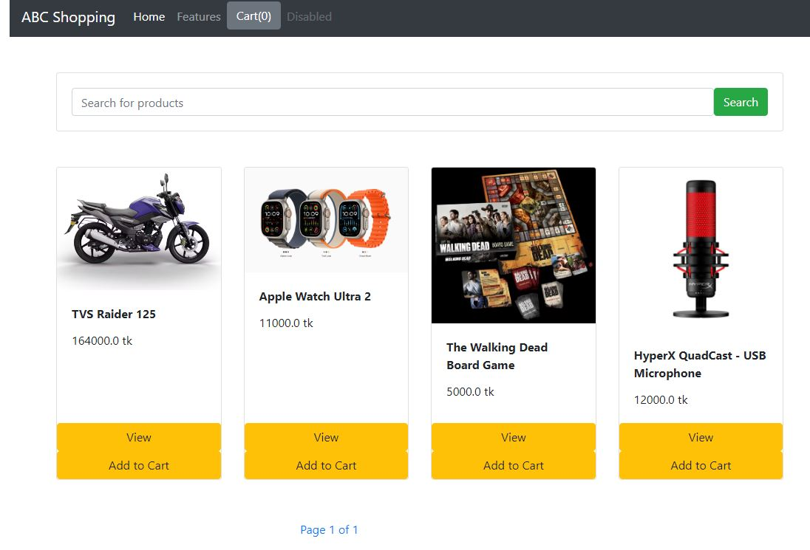
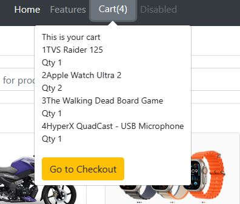
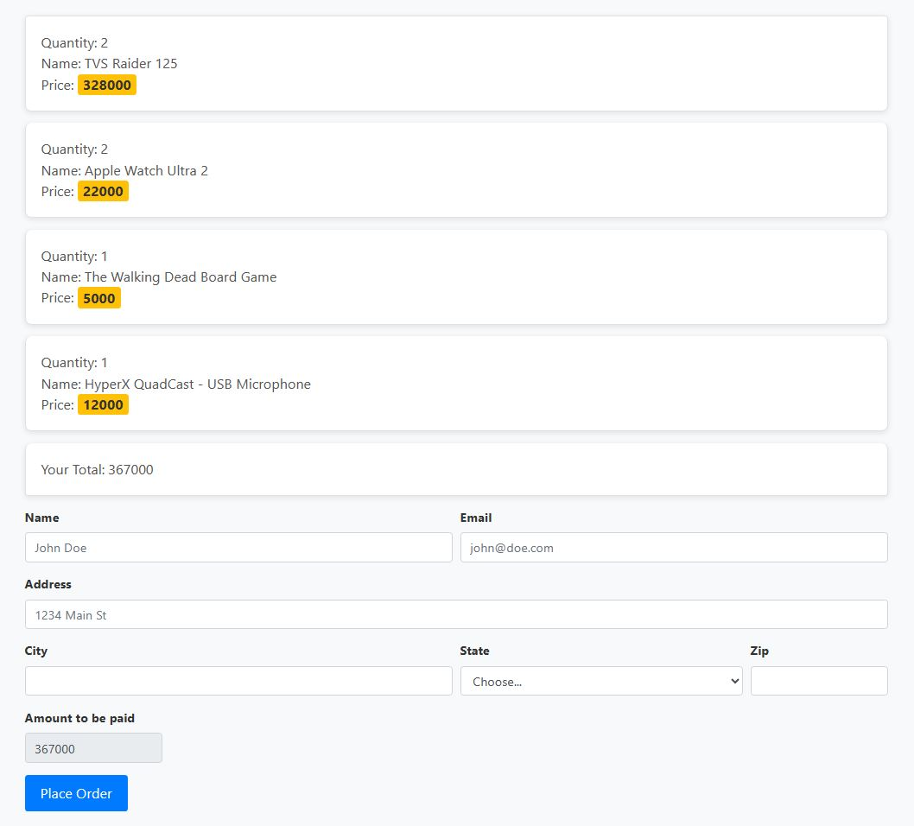

# Ecom_site
Simple Ecommerce website using Django 
## Screenshots

### Homepage Page

### Detail Page

### Register Page

### Checkout Page

## Learning Outcomes

### 1. Local Storage for Cart Management
In this project, I delved into utilizing the browser's local storage to create and manage the user's shopping cart. It's an invaluable skill, especially for a Django web app, ensuring that data remains accessible even when users close or refresh the page.

### 2. Integration of JavaScript and Django
I focused on seamlessly integrating JavaScript with Django to power our cart functionality. The entire project revolves around JavaScript, Django, and a bit of jQuery for smooth communication between the front-end and back-end. 

### 3. Posting Form Data Directly to the Database
I opted for a straightforward approach to store user-generated content in the backend. By posting form data directly to the database using the POST method in Django views, I collected and validated data on the server side and employed the `save()` method of the Django model.

### 4. jQuery for Front-End User Actions
While acknowledging the availability of more advanced frameworks like Angular or Vue.js, I chose jQuery for its lightweight nature. It's simple yet effective, handling front-end user actions such as dynamic cart updates and form input validation.

## Project Overview

This repository contains the codebase for an e-commerce website project. The goal is to offer a hands-on experience in building a functional web application, emphasizing the seamless integration of front-end and back-end technologies based on the outlined learning outcomes.

## Getting Started

To run the project locally, follow these steps:

1. Clone the repository to your machine.
2. Install the required dependencies as outlined in the project documentation.
3. Configure Django settings and set up the database.
4. Run the development server and open the application in your web browser.
5. Explore the implemented features, paying attention to the use of local storage, JavaScript-Django integration, form data handling, and jQuery for front-end interactions.

## Contribution Guidelines

If you're interested in contributing, please check out the [Contribution Guidelines](CONTRIBUTING.md) for details on how to get involved, submit issues, or propose new features.

## License

This project is licensed under the [MIT License](LICENSE). Feel free to reach out with any questions, issues, or suggestions. Happy coding!
